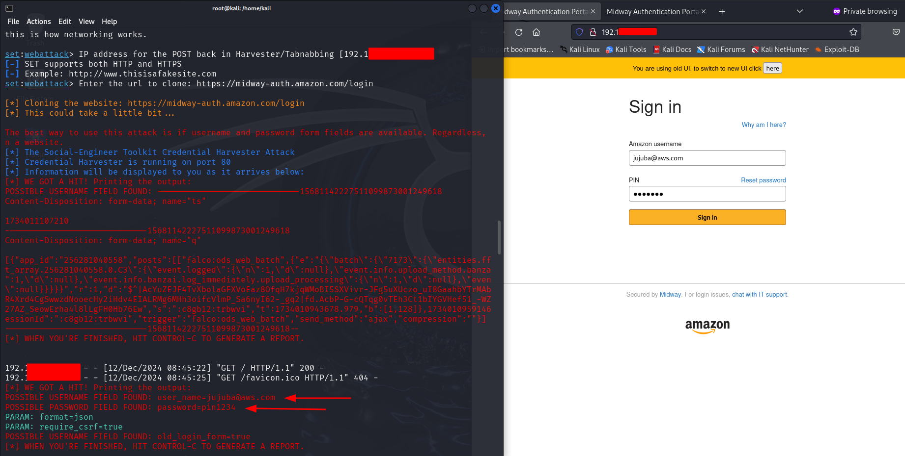

# Phishing para captura de senhas

### Ferramentas

- Kali Linux
- setoolkit

### Configurando o Phishing no Kali Linux

- Acesso root: ``` sudo su ```
- Iniciando o setoolkit: ``` setoolkit ```
- Tipo de ataque: ``` Social-Engineering Attacks ``` - Set 1
- Vetor de ataque: ``` Web Site Attack Vectors ``` - Set 2
- Método de ataque: ```Credential Harvester Attack Method ``` - Set 3
- Método de ataque: ``` Site Cloner ``` - Set 2

- Obtendo o endereço da máquina: ``` ip -br a ```

- URL para clone: https://www.facebook.com (Não funcionou)


- URL para clone: https://login.yahoo.com


- URL para clone: https://midway-uth.amazon.com/login


Se atente no aviso para usar a nova interface.
Pedindo usuario e senha em telas diferentes "inviabiliza" este tipo de ataque?


- URL para clone: um site WP qualquer


